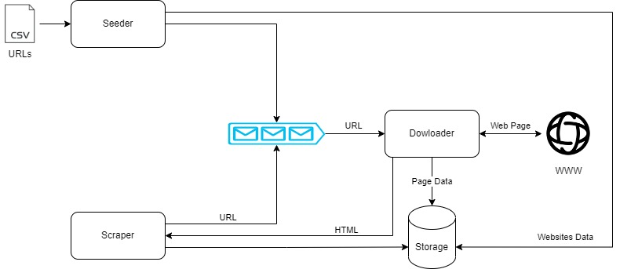

# Crawler 

This crawler gets a CSV file as an input with the below structructure:

```
website_host, number_of_pages_to_download

http://itcorp.com/, 4

https://www.vortex.com/, 7
```

For each website host in the CSV file, the crawler will save it's HTML content and scrap all the urls from the page.

For all referred pages that are on the same website host, the crawler will do the same, save their content and scrap the urls for more unreached pages.

This diagram describes the application components and interactions:



The crawler saves all data in MongoDB. Currently in a single websites collection, with the below document schema:
```
    url : string <index>
    numPagesToDownload : int   
    maxConcurrentConnections : int
    downloadedPages : int
    dom : string
    pages: [
        {
            url : string
            dom : string
        }
    ]
```
# Usage

- The application requires MongoDB. Connection details can be defined in the .env file as MONGODB_HOST and MONGODB_PORT. Currently supports no authentication connection only.
For quick localhost install, you can refer to this website: 
https://www.mongodb.com/try/download/community?tck=docs_server

- The application uses the following libraries:
```
pip install requests lxml pymongo pandas python-dotenv aiokafka
```
you can also use the requirements file
```
pip install -r requirements.txt
```

# Configuration

- To use different csv file, set in the .env file the parameter
``` 
CSV_FILE 
```

- Additional parameters that can be changed in the .env file:
```
MAX_CONCURRENT_CONNECTIONS_WEBSITE - max concurrent connections per website - default is 2
MAX_OVERALL_CONNECTIONS - max overall connections defined for the whole application - default is 10
MAX_DOWNLOAD_RETRIES - max number of retries when page download failed - default is 3
DOWNLOAD_RETRIES_INTERVAL_SEC - time between download retries in seconds - default is 5
```

# Scalability

For scalable use, it is recommended to deploy each component on a seperate container and change the urls queue to Kafka topic.


# Issues to fix:

1. Urls set has duplicates when there's a query string e.g. http://www.pmichaud.com/wiki/Pm/HomePage?action=edit and http://www.pmichaud.com/wiki/Pm/HomePage?action=diff
2. Need to add tests - units and integration tests based on the description below.
3. Some urls content are not saved in DB with TypeError

# Tests to perform:

1. Settings are read and used as expected
2. DB - data is saved correctly and retrieved correctlly
3. Logic - no duplications in pages and urls, number of retries, number of open connections,
    number of pages downloaded as defined, correct handel of loops
4. Messages - no duplications of urls, message is read only once
5. Seeder - csv file is read correctlly, adds correct metadata to the DB website collection and
    correct messages are added